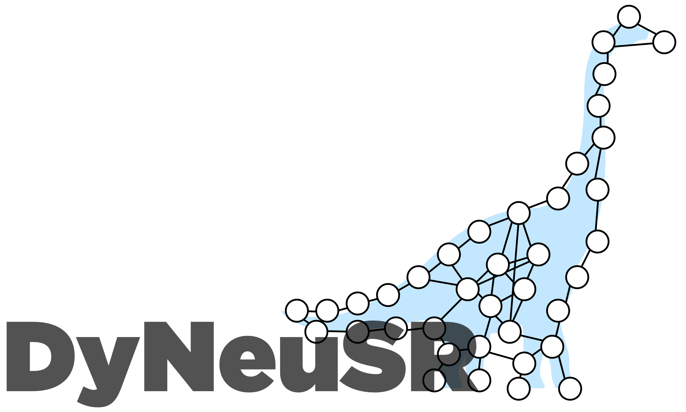
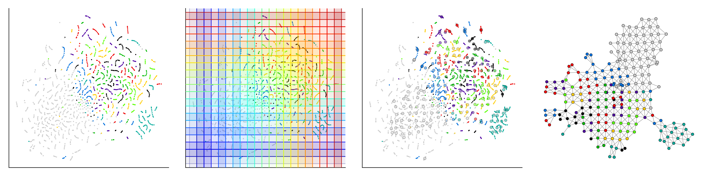
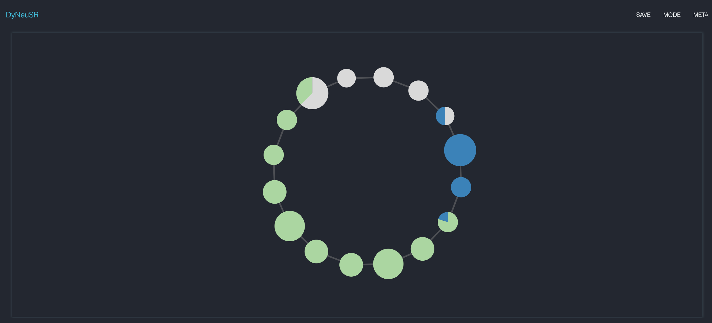
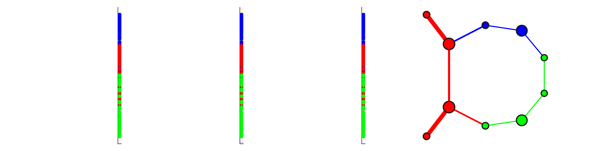
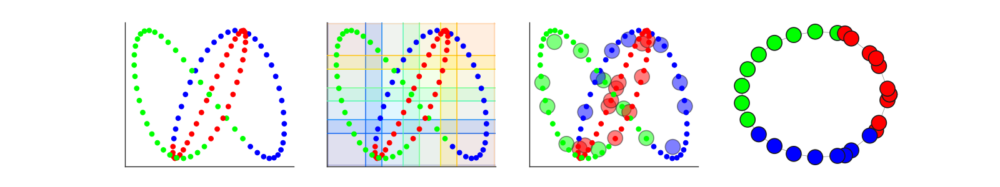
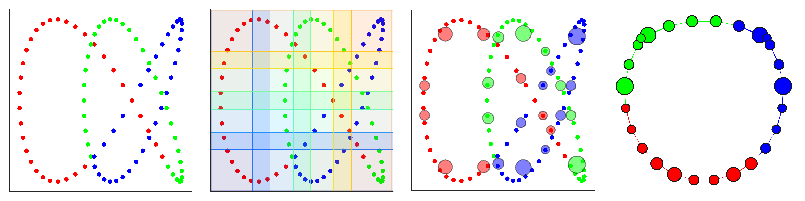

<p align="center">

</p>

<p align="center">

</p>

# **Dy**namical **Neu**roimaging **S**patiotemporal **R**epresentations

DyNeuSR is a Python visualization library for topological representations of neuroimaging data.

[DyNeuSR](https://braindynamicslab.github.io/dyneusr/) connects the Mapper algorithm (e.g. [KeplerMapper](https://kepler-mapper.scikit-tda.org)) with network analysis tools (e.g. [NetworkX](https://networkx.github.io/)) and other neuroimaging data visualization libraries (e.g. [Nilearn](https://nilearn.github.io/)). It provides a high-level interface for interacting with shape graph representations of neuroimaging data and relating such representations back to neurophysiology.

This package was designed specifically for working with shape graphs produced by the Mapper algorithm from topological data analysis (TDA) as described in the paper ["Towards a new approach to reveal dynamical organization of the brain using topological data analysis"](https://www.nature.com/articles/s41467-018-03664-4) (Saggar et al., 2018). See this [blog post](https://bdl.stanford.edu/blog/tda-cme-paper/) for more about the initial work that inspired the development of DyNeuSR. 


## References:

> Geniesse, C., Sporns, O., Petri, G., Saggar, M. (in press). [Generating dynamical neuroimaging spatiotemporal representations (DyNeuSR) using topological data analysis](https://web.stanford.edu/group/bdl/papers/geniesse-dyneusr/). *Network Neuroscience*.
>
> Saggar, M., Sporns, O., Gonzalez-Castillo, J., Bandettini, P.A., Carlsson, G., Glover, G., Reiss, A.L. (2018). [Towards a new approach to reveal dynamical organization of the brain using topological data analysis](https://www.nature.com/articles/s41467-018-03664-4). *Nature Communications*. doi:10.1038/s41467-018-03664-4


## Examples

This package includes several [examples](./examples/) that introduce DyNeuSR's API and highlight different aspects of analysis with DyNeuSR. For more detailed tutorials, checkout [dyneusr-notebooks](https://github.com/braindynamicslab/dyneusr-notebooks/).


### Basic usage ([trefoil knot](./examples/trefoil_knot))

```python

from dyneusr import DyNeuGraph
from dyneusr.datasets import make_trefoil
from dyneusr.tools import visualize_mapper_stages
from kmapper import KeplerMapper

# Generate synthetic dataset
dataset = make_trefoil(size=100)
X = dataset.data
y = dataset.target

# Generate shape graph using KeplerMapper
mapper = KeplerMapper(verbose=1)
lens = mapper.fit_transform(X, projection=[0])
graph = mapper.map(lens, X, nr_cubes=6, overlap_perc=0.2)

# Visualize the shape graph using DyNeuSR's DyNeuGraph                          
dG = DyNeuGraph(G=graph, y=y)
dG.visualize('dyneusr_output.html')

```

<p align="center"><a href="./examples/trefoil_knot">

</a></p>


### Advanced usage ([trefoil knot](./examples/trefoil_knot))

```python
# Define projections to compare
projections = ([0], [0,1], [1,2], [0, 2])

# Compare different sets of columns as lenses
for projection in projections:

	# Generate shape graph using KeplerMapper
	mapper = KeplerMapper(verbose=1)
	lens = mapper.fit_transform(X, projection=projection)
	graph = mapper.map(lens, X, nr_cubes=4, overlap_perc=0.3)

	# Visualize the stages of Mapper
	fig, axes = visualize_mapper_stages(
		dataset, lens=lens, graph=graph, cover=mapper.cover, 
		layout="spectral")
		
```

<p align="center"><a href="./examples/trefoil_knot">




</a></p>


### Neuroimaging examples ([haxby decoding](./examples/haxby_decoding))

```python

import numpy as np 
import pandas as pd

from nilearn.datasets import fetch_haxby
from nilearn.input_data import NiftiMasker

from kmapper import KeplerMapper, Cover
from sklearn.manifold import TSNE
from sklearn.cluster import DBSCAN

# Fetch dataset, extract time-series from ventral temporal (VT) mask
dataset = fetch_haxby()
masker = NiftiMasker(
    dataset.mask_vt[0], 
    standardize=True, detrend=True, smoothing_fwhm=4.0,
    low_pass=0.09, high_pass=0.008, t_r=2.5,
    memory="nilearn_cache")
X = masker.fit_transform(dataset.func[0])

# Encode labels as integers
df = pd.read_csv(dataset.session_target[0], sep=" ")
target, labels = pd.factorize(df.labels.values)
y = pd.DataFrame({l:(target==i).astype(int) for i,l in enumerate(labels)})

# Generate shape graph using KeplerMapper
mapper = KeplerMapper(verbose=1)
lens = mapper.fit_transform(X, projection=TSNE(2))
graph = mapper.map(lens, X, cover=Cover(20, 0.5), clusterer=DBSCAN(eps=20.))

# Visualize the shape graph using DyNeuSR's DyNeuGraph                          
dG = DyNeuGraph(G=graph, y=y)
dG.visualize('dyneusr_output.html')

```

<p align="center"><a href="./examples/haxby_decoding">

</a></p>


## Setup

Online documentation (*coming soon*) will include more details about how to install and get started with DyNeuSR.

### Dependencies

- Python 3.6 (*This package has only been tested with Python 3.6!*)

The following Python packages are required:

-  [numpy](www.numpy.org)
-  [pandas](pandas.pydata.org)
-  [scipy](www.scipy.org)
-  [scikit-learn](scikit-learn.org)
-  [matplotlib](matplotlib.sourceforge.net)
-  [seaborn](stanford.edu/~mwaskom/software/seaborn)
-  [networkx](networkx.github.io)
-  [nilearn](nilearn.github.io)
-  [kmapper](kepler-mapper.scikit-tda.org)

For the full list of packages and required versions, see [`requirements.txt`](./requirements.txt) and [`requirements-versions.txt`](./requirements-versions.txt)


### Installing from source with conda

If your default environment is Python 2, we recommend that you install `dyneusr` in a separate Python 3 environment. 

You can find more information about creating a separate environment for Python 3, [here](https://salishsea-meopar-docs.readthedocs.io/en/latest/work_env/python3_conda_environment.html). If you don't have conda, or are new to scientific python, we recommend that you download the [Anaconda scientific python distribution](https://store.continuum.io/cshop/anaconda/). 

To create a new conda environment and install from source:
```bash
conda create -n dyneusr python=3.6
conda activate dyneusr

git clone https://github.com/braindynamicslab/dyneusr.git
cd dyneusr

conda install --file requirements-conda.txt
pip install -e .

pytest
```

This creates a new conda environment `dyneusr` and installs in it the dependencies that are needed. To access it, use the `conda activate dyneusr` command (if your conda version >= 4.4) and use `source activate dyneusr` command (if your conda version < 4.4).

### Installing from source with pip

Installing from source with pip is simple. In a command prompt:

```bash
git clone https://github.com/braindynamicslab/dyneusr.git
cd dyneusr

pip install -r requirements.txt
pip install -e .

pytest
```


## Support

Please feel free to [report](https://github.com/braindynamicslab/dyneusr/issues/new) any issues, [request](https://github.com/braindynamicslab/dyneusr/issues/new) new features, or [propose](https://github.com/braindynamicslab/dyneusr/compare) improvements.

If you're interested in contributing to DyNeuSR, please also refer to the [Contributing](./CONTRIBUTING.md) guide. 


## Citing DyNeuSR

If you use DyNeuSR in your published work, please cite:

> Geniesse, C., Sporns, O., Petri, G., Saggar, M. (in press). [Generating dynamical neuroimaging spatiotemporal representations (DyNeuSR) using topological data analysis](https://web.stanford.edu/group/bdl/papers/geniesse-dyneusr/). *Network Neuroscience*.

